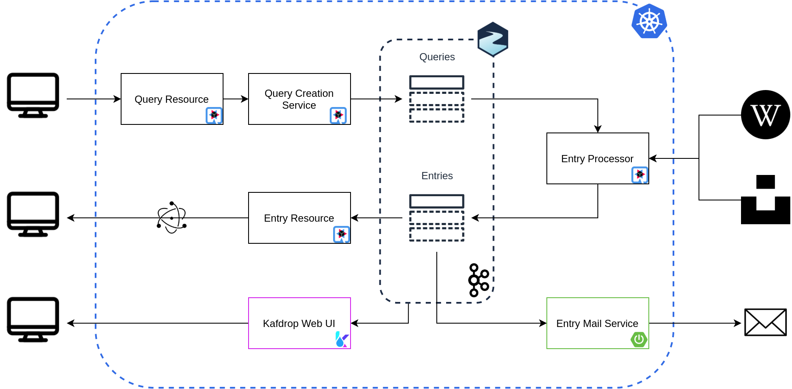

# Eclipse JKube + Apache Kafka related projects

## Requirements

Setup Strimzi Operator.
```shell script
$ kubectl create namespace kafka
$ kubectl apply -f 'https://strimzi.io/install/latest?namespace=kafka' -n kafka
```

Deploy a Kafka cluster.

```shell script
$ kubectl apply -f kafka-strimzi-setup.yaml
```

## Overview



## Kafdrop - Spring Boot 2.x Example

[Kafdrop – Kafka Web UI](https://github.com/obsidiandynamics/kafdrop)

```shell script
$ git clone git@github.com:obsidiandynamics/kafdrop.git
$ cd kafdrop
```

- Remove `:9000` default from `application.yml` properties (Env variable to Maven property).
  We want it to be processed by Maven Resources Plugin, so that JKube is aware of the final port for the Service
  creation.
  We could make the Service work with env variables too, but that'll require extra configuration.
- Add Kubernetes-Maven-Plugin.

```xml
<plugin>
 <groupId>org.eclipse.jkube</groupId>
 <artifactId>kubernetes-maven-plugin</artifactId>
 <version>1.0.2</version>
   <configuration>
       <resources>
           <env>
               <JAVA_ARGS>--kafka.brokerConnect=my-cluster-kafka-bootstrap.kafka.svc.cluster.local:9092</JAVA_ARGS>
           </env>
       </resources>
       <enricher>
           <config>
               <jkube-service>
                   <type>NodePort</type>
               </jkube-service>
           </config>
       </enricher>
   </configuration>
</plugin>
```

```shell script
$ git clone git@github.com:obsidiandynamics/kafdrop.git
# Add Kubernetes Maven Plugin to pom.xml
# Remove `:9000` default from application.yml properties (Small bug in KMP)
$ eval $(minikube docker-env)
$ mvn clean package -DskipTests -DSERVER_PORT=9009 k8s:build k8s:resource k8s:apply
```

If you want to try debug, add Maven project to IntelliJ, and breakpoint to `TopicController#getAllTopics`
```shell script
$ mvn k8s:debug
```

## Quarkus Kafka Example

## Spring Boot 1.x Kafka Example


